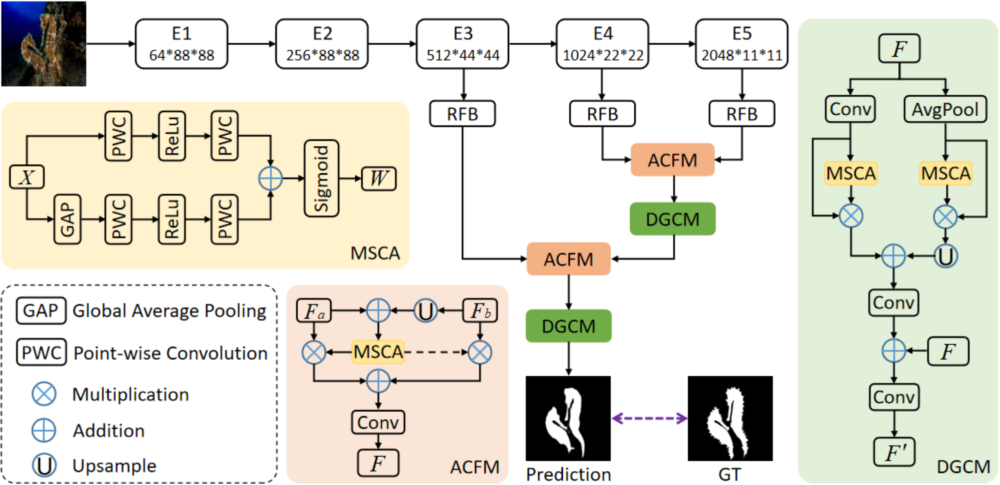
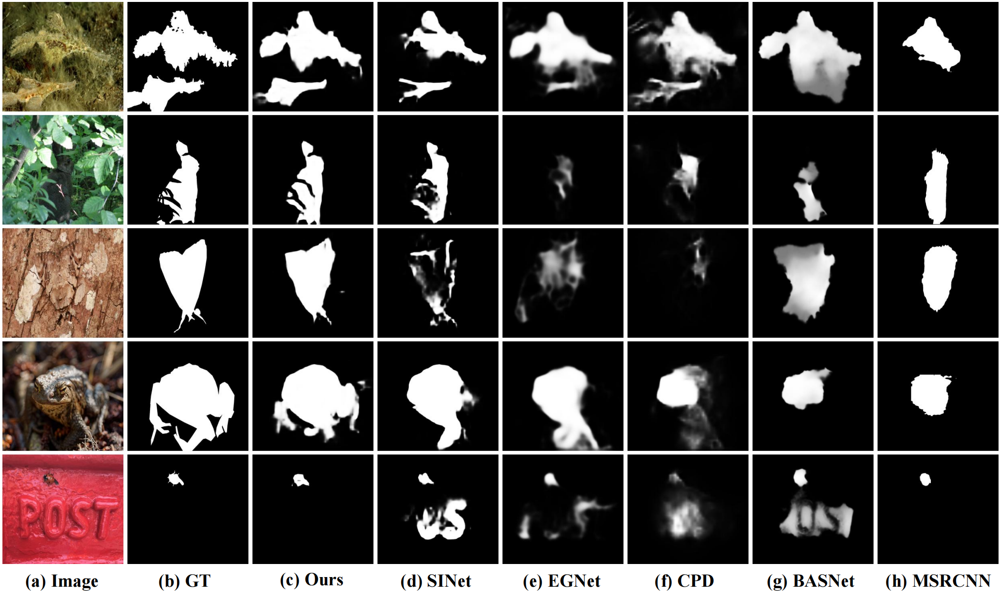

# C2FNet: Context-aware Cross-level Fusion Network for Camouflaged Object Detection (IJCAI 2021)

> **Authors:** 
> Yujia Sun,
> Geng Chen,
> Tao Zhou,
> Yi Zhang,
> and Nian Liu.

## 1. Preface

- This repository provides code for "_**Context-aware Cross-level Fusion Network for Camouflaged Object Detection**_" IJCAI-2021. 
- The journal extension version of our paper is accepted at IEEE TCSVT 2022 ([Paper](https://arxiv.org/abs/2207.13362) | [GitHub](https://github.com/Ben57882/C2FNet-TSCVT)).

<!---
## 2. Overview

### 2.1. Introduction
Camouflaged object detection (COD) is a challenging task due to the low boundary contrast between the object and its surroundings. In addition, the appearance of camouflaged objects varies significantly, e.g., object size and shape, aggravating the difficulties of accurate COD. In this paper, we propose a novel Context-aware Cross-level Fusion Network (C2FNet) to address the challenging COD task.Specifically, we propose an Attention-induced Cross-level Fusion Module (ACFM) to integrate the multi-level features with informative attention coefficients. The fused features are then fed to the proposed Dual-branch Global Context Module (DGCM), which yields multi-scale feature representations for exploiting rich global context information. In C2FNet, the two modules are conducted on high-level features using a cascaded manner. Extensive experiments on three widely used benchmark datasets demonstrate that our C2FNet is an effective COD model and outperforms state-of-the-art models remarkably. 

### 2.2. Framework Overview

      
    <em> 
    Figure 1: The overall architecture of the proposed model, which consists of two key components, i.e., attention-induced cross-level fusion module and dual-branch global context module. See § 3 in the paper for details.
    </em>

### 2.3. Qualitative Results

      
    <em> 
    Figure 2: Qualitative Results.
    </em>

-->

## 2. Proposed Baseline

### 2.1. Training/Testing

The training and testing experiments are conducted using [PyTorch](https://github.com/pytorch/pytorch) with 
a single NVIDIA Tesla P40 GPU of 24 GB Memory.

1. Configuring your environment (Prerequisites):
    
    + Creating a virtual environment in terminal: `conda create -n C2FNet python=3.6`.
    
    + Installing necessary packages: `pip install -r requirements.txt`.

1. Downloading necessary data:

    + downloading testing dataset and move it into `./data/TestDataset/`, 
    which can be found in this [download link (Google Drive)](https://drive.google.com/file/d/1SLRB5Wg1Hdy7CQ74s3mTQ3ChhjFRSFdZ/view?usp=sharing).
    
    + downloading training dataset and move it into `./data/TrainDataset/`, 
    which can be found in this [download link (Google Drive)](https://drive.google.com/file/d/1Kifp7I0n9dlWKXXNIbN7kgyokoRY4Yz7/view?usp=sharing).
    
    + downloading pretrained weights and move it into `./checkpoints/C2FNet40/C2FNet-39.pth`, 
    which can be found in this [download link (Google Drive)](https://drive.google.com/file/d/1zG7FjmYwpSagjXG3yhLUA5sjlvEvQvJl/view?usp=sharing).
    
    + downloading Res2Net weights and move it into `./models/res2net50_v1b_26w_4s-3cf99910.pth`,
    which can be found in this [download link (Google Drive)](https://drive.google.com/file/d/1_1N-cx1UpRQo7Ybsjno1PAg4KE1T9e5J/view?usp=sharing).

1. Training Configuration:

    + Assigning your costumed path, like `--train_save` and `--train_path` in `MyTrain.py`.
    + I modify the total epochs and the learning rate decay method (lib/utils.py has been updated), so there are differences from the training setup reported in the paper. Under the new settings, the training performance is more stable.

1. Testing Configuration:

    + After you download all the pre-trained model and testing dataset, just run `MyTest.py` to generate the final prediction map: 
    replace your trained model directory (`--pth_path`).

### 2.2 Evaluating your trained model:

One-key evaluation is written in MATLAB code (revised from [link](https://github.com/DengPingFan/CODToolbox)), 
please follow this the instructions in `./eval/main.m` and just run it to generate the evaluation results in.

If you want to speed up the evaluation on GPU, you just need to use the efficient tool [link](https://github.com/lartpang/PySODMetrics) by `pip install pysodmetrics`.

Assigning your costumed path, like `method`, `mask_root` and `pred_root` in `eval.py`.

Just run `eval.py` to evaluate the trained model.

> pre-computed map can be found in [download link](https://drive.google.com/file/d/1l_qaEOWNaZVyEu7rk9K_C9Pcuicay0uk/view?usp=sharing).

## 3. Citation

Please cite our paper if you find the work useful: 

	@inproceedings{sun2021c2fnet,
	title={Context-aware Cross-level Fusion Network for Camouflaged Object Detection},
	author={Sun, Yujia and Chen, Geng and Zhou, Tao and Zhang, Yi and Liu, Nian},
	booktitle={IJCAI},
	pages = "1025--1031",
	year={2021}
	}
	
	@article{chen2022camouflaged,
	title={Camouflaged Object Detection via Context-aware Cross-level Fusion},
	author={Chen, Geng and Liu, Si-Jie and Sun, Yu-Jia and Ji, Ge-Peng and Wu, Ya-Feng and Zhou, Tao},
	journal={IEEE Transactions on Circuits and Systems for Video Technology},
	year={2022},
	publisher={IEEE}
	}

**[⬆ back to top](#1-preface)**
